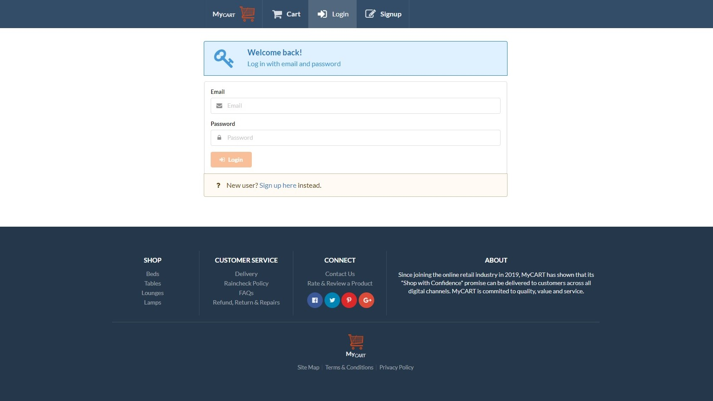

# **My**<i>CART</i> 

## MERN Stack eCommerce Progressive Web Application

## Use cases / User stories

- “As the Root user, I would like to restrict permissions based on role.”
- “As an Administrator, I would like to add and delete sale items.”
- “As a User, I would like to view, add to my cart and purchase sale items.”
- "As a Guest, I would like to browse sale items without having to signup or login."
- “As a Guest, I would like to be able to signup with a secure authentication method."

## Build Features

- User authentication with <a href="https://jwt.io/" target="_blank">JWT</a> + <a href="https://www.npmjs.com/package/bcrypt" target="_blank">bcrypt</a>
- Image uploads are managed by <a href="https://cloudinary.com/" target="_blank">Cloudinary</a> prior to database storage.
- Server Side Rendering using <a href="https://nextjs.org/" target="_blank">Next.js</a>.
- Payment Processing with <a href="https://stripe.com/au" target="_blank">Stripe</a> Online Payment API.
- Full Node API with CRUD Functionality.
- No exposed sensitive keys.
- Manageable User Roles (togglable by the Root user).
- Pagination.
- Responsive <a href="https://react.semantic-ui.com/" target="_blank">Semantic UI React</a> Front End.
- Full set of Progressive Web App favicons created with <a href="https://realfavicongenerator.net/" target="_blank">Favicon Generator</a>.

- Complete app deployment with Heroku: <a href="https://shop-my-cart.herokuapp.com" target="_blank">**My<i>CART**</i> </a>

## Build Dependencies:

- axios
- bcrypt
- js-cookie
- jsonwebtoken
- mongoose
- next
- nookies
- nprogress
- react
- react-dom
- react-stripe-checkout
- semantic-ui-react
- shortid
- stripe
- uuid
- validator

## What's Next?

- Track stock numbers. Not limited to one store but multiple stores.
